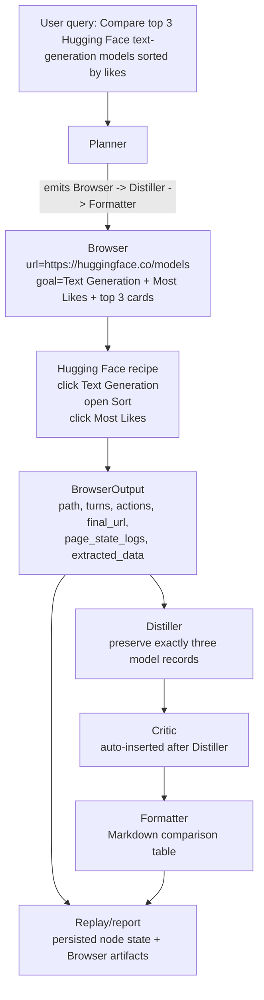
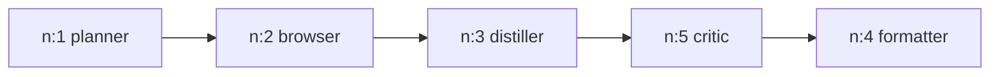
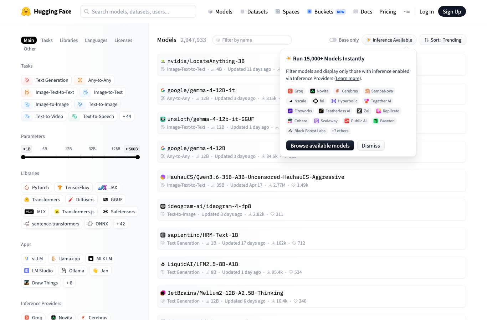
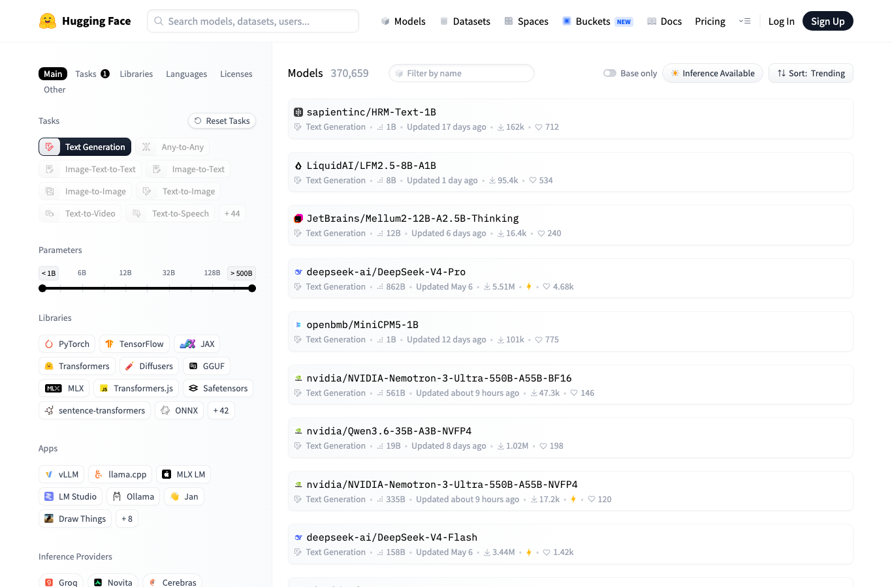
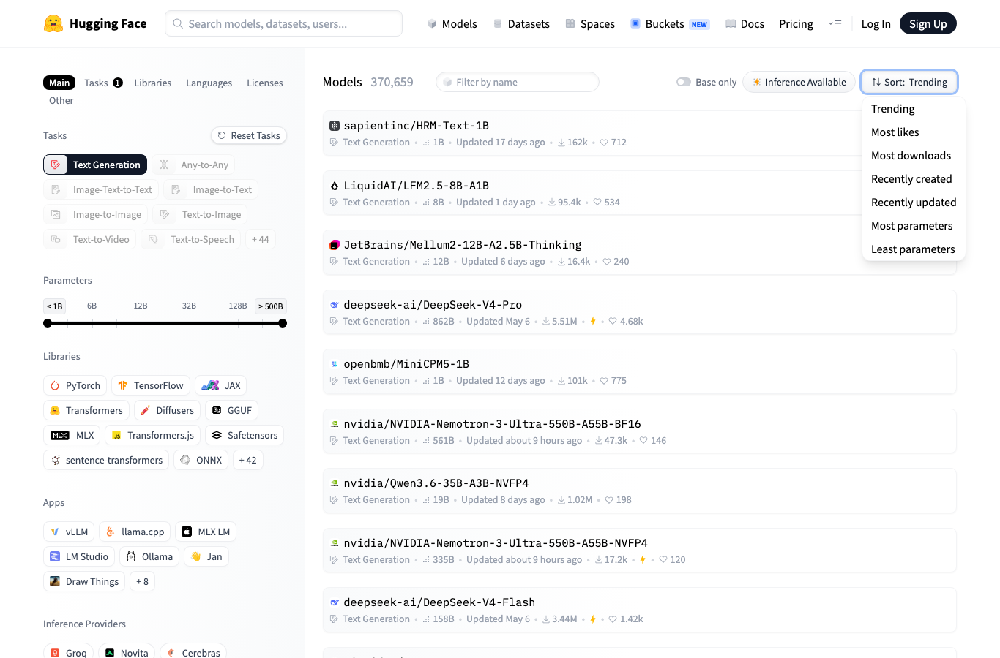
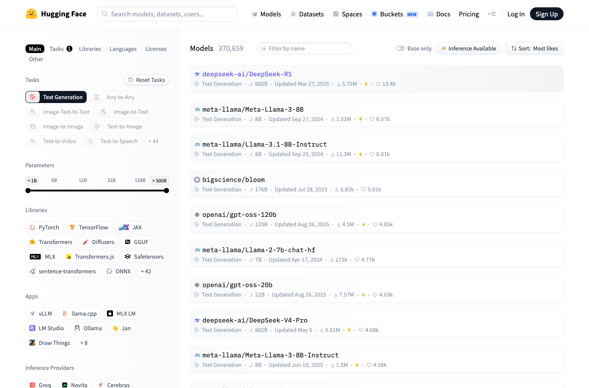

# EAGV3 — Session 9: Browser-Capable Agent

A multi-agent orchestrator that decomposes a user query into a **growing
DAG** of skills (Planner, Researcher, Browser, Distiller, Critic, Formatter,
Coder, …) and executes it node-by-node, backed by a custom **LLM gateway** that
auto-routes each request to the cheapest capable provider by token size.

Session 9 adds the headline feature — a **Browser skill** that interacts with
real web pages through a four-layer cost cascade, escalating to a vision model
only when cheaper layers fail.

> This is a course deliverable (EAGV3). It runs entirely on free-tier LLM
> providers and stores all state on local disk.

## How it fits together

The repo is **two processes** that talk over HTTP:

| Process | Path | Role |
|---------|------|------|
| **Agent orchestrator** | [`code/`](code/) | Reads a query, builds and executes a NetworkX DAG of skills. Entry point: [`flow.py`](code/flow.py). |
| **LLM gateway (V9)** | [`llm_gatewayV9/`](llm_gatewayV9/) | FastAPI service on **`:8109`**. Routes `/v1/chat`, `/v1/embed`, and `/v1/vision` calls across seven worker providers. Entry point: [`main.py`](llm_gatewayV9/main.py). |

The agent calls the gateway for every LLM/embedding/vision step. If the gateway
isn't already running, [`code/gateway.py`](code/gateway.py) auto-starts it on
`:8109` on first use.

```
EAG3-09/
├── code/                  # the orchestrator
│   ├── flow.py            # main: growing-graph executor + scheduler
│   ├── skills.py          # skill dispatch + input resolution
│   ├── agent_config.yaml  # skill registry (prompts, tools, per-skill settings)
│   ├── prompts/           # one system-prompt template per skill (*.md)
│   ├── browser/           # Session 9 Browser skill (4-layer cascade)
│   ├── memory.py          # FAISS-backed vector memory
│   ├── recovery.py        # failure classification + recovery decisions
│   ├── persistence.py     # per-session DAG + node snapshots
│   ├── replay.py          # inspect a finished session; Markdown/HTML reports
│   └── state/             # runtime state (sessions, artifacts, FAISS index)
├── llm_gatewayV9/         # the gateway (see its own README for provider matrix)
├── logs/                  # demo output logs
└── run_demo.sh            # curated demo runner
```

## Architecture

The agent grew across sessions: single agent with cognitive roles (S6) → add
semantic vector memory (S7) → replace the fixed loop with a **growing DAG** and
a skills catalogue (S8) → add the **Browser skill + vision gateway** (S9).

The Planner emits an initial DAG of skill nodes; the executor runs ready nodes
in topological order, and the graph grows at runtime from planner successors,
static skill successors (e.g. Coder → SandboxExecutor), and auto-inserted Critic
nodes. On failure, the Planner is re-invoked to splice in a recovery subgraph.

### The four-layer Browser cascade

The Browser skill picks the cheapest way to do each job and only spends more
when the cheap way fails:

| Layer | Method | Cost | Use case |
|-------|--------|------|----------|
| **1 — Extract** | `httpx` + `trafilatura` (no browser, no LLM) | $0 | Static content sites (blogs, docs). |
| **2a — Deterministic** | Playwright + hand-written CSS selectors (no LLM) | $0 | Sites with known-stable DOM. |
| **2b — A11y tree** | Playwright + accessibility tree + cheap text LLM | ~tiny | Dynamic pages with filters/dropdowns. |
| **3 — Vision** | Playwright + set-of-marks screenshot + VLM | per-call vision cost | JS-heavy pages with no useful a11y tree. |

Above all four sits a precondition check: if a CAPTCHA, login wall, geo-block,
or rate limit stops the page from rendering, the skill returns
`error_code="gateway_blocked"` so the orchestrator can re-route. See
[Assignment: Browser comparison task](#assignment-browser-comparison-task) below
for how this cascade meets the Session 9 assignment end-to-end.

## Prerequisites

- **Python 3.11+** and [`uv`](https://docs.astral.sh/uv/)
- **Playwright Chromium** (for the Browser skill):
  ```bash
  cd code && uv run playwright install chromium
  ```
- A **`.env`** at the repo root with at least one LLM provider key, plus an
  optional `TAVILY_API_KEY` for web search (the agent falls back to DuckDuckGo
  without it). See [`llm_gatewayV9/README.md`](llm_gatewayV9/README.md) for the
  full provider/key/model matrix — the gateway routes across seven workers and
  fails over automatically.

## Setup & run

Two terminals:

```bash
# Terminal 1 — start the gateway (serves :8109)
cd llm_gatewayV9
uv run main.py
# or:
./run.sh

# Terminal 2 — run the agent on a query
cd code
uv sync
uv run python flow.py "When was Claude Shannon born and when did he die?"
```

> You can skip Terminal 1 — `code/gateway.py` auto-starts the gateway on `:8109`
> if it isn't already up. Running it yourself just makes the gateway logs and
> dashboard easy to watch.

## Demos

[`run_demo.sh`](run_demo.sh) runs curated queries that each exercise one
orchestrator feature. Each query's stdout is teed to `logs/<slug>.log`, and the
script prints the session id plus a one-liner to inspect any node's rendered
prompt.

Run demo commands from the repo root:

```bash
cd /Users/pravingadekar/Documents/EAG3/EAG3-09/EAG3-09
```

```bash
./run_demo.sh              # pytest + the 5 canonical queries
./run_demo.sh tests        # unit tests only
./run_demo.sh hello        # smallest DAG: planner → formatter
./run_demo.sh shannon      # single-item query (USER_QUERY flow)
./run_demo.sh populations  # parallel fan-out (per-worker scoping)
./run_demo.sh structured   # forces distiller → auto-critic chain
./run_demo.sh fail         # graceful fail-by-planning
./run_demo.sh browser      # Session 9 Browser skill end-to-end
./run_demo.sh wipe         # clear state/sessions + logs
```

The default `./run_demo.sh` run covers the non-browser path: unit tests, then
`hello`, `shannon`, `populations`, `structured`, and `fail`. The Browser demo is
separate because it needs Playwright Chromium and exercises the Session 9
Browser skill end-to-end:

```bash
cd code
uv run playwright install chromium   # one-time setup for browser demos
cd ..
./run_demo.sh browser
```

Each run writes its log to `logs/<slug>.log` and its full DAG + per-node
snapshots to `code/state/sessions/<session_id>/`.

If your terminal says `zsh: no such file or directory: ./run_demo.sh`, you are
not in the repo root. Run:

```bash
cd /Users/pravingadekar/Documents/EAG3/EAG3-09/EAG3-09
./run_demo.sh
```

Common terminal flow for live demos:

```bash
# Terminal 1
cd /Users/pravingadekar/Documents/EAG3/EAG3-09/EAG3-09/llm_gatewayV9
./run.sh

# Terminal 2
cd /Users/pravingadekar/Documents/EAG3/EAG3-09/EAG3-09
./run_demo.sh
# or, for the Browser skill:
./run_demo.sh browser
```

## Testing

```bash
cd code
uv run pytest          # recovery, recovery-amnesia, critic-autoinsert, vision-search
```

## Inspecting a session

Replay a finished session's DAG and node outputs in completion order:

```bash
cd code
uv run python replay.py <session_id>
```

Generate the assignment replay report as Markdown:

```bash
cd code
uv run python replay.py --report <session_id>
```

Generate the same report as a browser-friendly static HTML file:

```bash
cd code
uv run python replay.py --html <session_id>
```

By default, the HTML report is written to:

```text
code/state/sessions/<session_id>/replay_report.html
```

You can also choose the destination:

```bash
uv run python replay.py --html --output /tmp/replay.html <session_id>
```

The HTML report keeps the same eight assignment sections as `--report`, but
adds inline screenshot previews, collapsible page-state logs, a node summary,
critic result, extracted JSON, and a rendered HTML comparison table. For
example, the checked live Browser assignment run can be rendered with:

```bash
cd /Users/pravingadekar/Documents/EAG3/EAG3-09/EAG3-09/code
uv run python replay.py --html s8-dfa90971
```

To see the exact prompt sent for a given node:

```bash
python3 -c "import json; print(json.load(open('state/sessions/<session_id>/nodes/n_001.json'))['prompt_sent'])"
```

## Assignment: Browser comparison task

Session 9 asks for a browser-capable agent that completes a real web comparison
and produces a replayable report of the run.

### The task

> Compare top 3 Hugging Face text-generation models sorted by likes.

Constraints:

- The answer must come from **browser interaction**, not passive search snippets.
- The agent must perform **at least three visible browser actions**.
- The final answer must include a **structured comparison table**.
- The replay report must show the original goal, Planner DAG, Browser path,
  Browser actions, screenshots/page-state logs, extracted data, final table,
  turn count, and cost summary.
- The **orchestrator is not modified** — new behavior plugs in through the skill
  catalogue and the Browser skill extension.

### How the code satisfies it

| Requirement | Implementation |
|---|---|
| Compare top 3 HF text-generation models sorted by likes | `run_demo.sh browser` uses the exact assignment query. `prompts/planner.md` hard-routes the Browser node to `https://huggingface.co/models` with Text Generation + Most Likes in `metadata.goal`. |
| Browser interaction, not snippets | `code/browser/recipes.py` drives the rendered HF page with Playwright-visible actions, then extracts model cards (rejecting docs/blog/dataset/space/nav links). `code/browser/skill.py` runs this recipe before the generic cascade. |
| ≥3 visible browser actions | The HF recipe records three: click Text Generation, open the Sort menu, click Most Likes — returned in `BrowserOutput.actions`. |
| Structured comparison table | `prompts/distiller.md` emits exactly three model records; `prompts/formatter.md` renders a Markdown table (Rank, Model, Likes, Downloads, Parameters, Description, URL). |
| Replay/report checklist | `code/replay.py` adds `--report` (Markdown) and `--html` (static HTML with inline screenshots and collapsible logs). |
| Browser path includes `blocked` | `BrowserOutput.path` accepts `blocked`; gateway-blocked failures return `error_code="gateway_blocked"`. |
| Screenshots / page-state logs | The recipe writes per-step screenshots and text logs under the session Browser artifact dir, surfaced in `BrowserOutput.page_state_logs`. |
| Extracted data | Parsed cards live in `BrowserOutput.extracted_data["models"]`, sorted by normalized likes while preserving the original display strings. |
| Turn count + cost | Browser turns from `BrowserOutput.turns`; report mode queries V9 `/v1/cost/by_agent?session=<id>` for per-agent calls, tokens, and dollars. |
| No orchestrator modification | `code/flow.py` is unchanged. |

### Assignment flow

For this query the Planner skips memory hits and web snippets and emits a
Browser-first DAG with the HF model index as the base URL and the
filtering/sorting instructions in metadata.



The route: Planner hard-routes the query to Browser → Distiller → Formatter →
`code/browser/skill.py` detects the target and runs the deterministic HF recipe →
the recipe performs the three visible actions, records screenshots/logs, extracts
and rank-sorts the cards → Distiller emits exactly three records (and, being
`critic: true` in `agent_config.yaml`, gets an auto-inserted Critic) → Formatter
renders the table → `replay.py --report/--html` assembles the evidence. If the
recipe can't extract three cards, the generic extract/deterministic/a11y/vision
[cascade](#the-four-layer-browser-cascade) still runs.

### Sample run — the eight report sections (session `s8-dfa90971`)

A real run of `./run_demo.sh browser`, rendered by `replay.py --html`. The eight
required sections, with the actual data from that session:

**1. Original user goal**

> Compare top 3 Hugging Face text-generation models sorted by likes. Return a
> structured comparison table.

**2. Planner DAG**



| Node | Skill | Status | Elapsed | Provider |
|------|-------|--------|---------|----------|
| n:1 | planner | complete | 2.2s | gemini |
| n:2 | browser | complete | 12.0s | – |
| n:3 | distiller | complete | 1.9s | gemini |
| n:4 | formatter | complete | 1.5s | gemini |
| n:5 | critic | complete | 1.1s | gemini |

**3. Browser path chosen** — `deterministic`
(one of `extract` / `deterministic` / `a11y` / `vision` / `blocked`).

**4. Browser actions taken** — three visible actions (not snippet scraping):

| Turn | Action | Result |
|------|--------|--------|
| 1 | click **Text Generation** | ok |
| 2 | open the **Sort** menu | ok |
| 3 | click **Most Likes** | ok |

**5. Screenshots / page-state logs** — one screenshot + text log per step under the
session Browser artifact dir; the committed copies:

| Loaded | Text Generation | Sort menu open | Most Likes |
|---|---|---|---|
|  |  |  |  |

<details>
<summary>Page-state log excerpt (final step)</summary>

```text
url: https://huggingface.co/models?pipeline_tag=text-generation&sort=likes
title: Text Generation Models – Hugging Face
Sort: Most likes
deepseek-ai/DeepSeek-R1 · Text Generation · 685B · 5.75M · 13.4k
meta-llama/Meta-Llama-3-8B · Text Generation · 8B · 1.52M · 6.57k
meta-llama/Llama-3.1-8B-Instruct · Text Generation · 8B · 11.3M · 6.01k
```
</details>

**6. Extracted data** — `BrowserOutput.extracted_data` (Critic verdict: **pass**):

```json
{
  "models": [
    { "rank": 1, "model_id": "deepseek-ai/DeepSeek-R1", "model_url": "https://huggingface.co/deepseek-ai/DeepSeek-R1", "likes": "13.4k", "downloads": "5.75M", "parameters": "685B", "description": "" },
    { "rank": 2, "model_id": "meta-llama/Meta-Llama-3-8B", "model_url": "https://huggingface.co/meta-llama/Meta-Llama-3-8B", "likes": "6.57k", "downloads": "1.52M", "parameters": "8B", "description": "" },
    { "rank": 3, "model_id": "meta-llama/Llama-3.1-8B-Instruct", "model_url": "https://huggingface.co/meta-llama/Llama-3.1-8B-Instruct", "likes": "6.01k", "downloads": "11.3M", "parameters": "8B", "description": "" }
  ],
  "sort_verified": true,
  "warnings": []
}
```

**7. Final comparison table**

| Rank | Model | Likes | Downloads | Parameters | Description | URL |
|------|-------|-------|-----------|------------|-------------|-----|
| 1 | deepseek-ai/DeepSeek-R1 | 13.4k | 5.75M | 685B | unavailable | [Link](https://huggingface.co/deepseek-ai/DeepSeek-R1) |
| 2 | meta-llama/Meta-Llama-3-8B | 6.57k | 1.52M | 8B | unavailable | [Link](https://huggingface.co/meta-llama/Meta-Llama-3-8B) |
| 3 | meta-llama/Llama-3.1-8B-Instruct | 6.01k | 11.3M | 8B | unavailable | [Link](https://huggingface.co/meta-llama/Llama-3.1-8B-Instruct) |

**8. Turn count and cost summary** — Browser turns: **3**. Per-agent gateway cost
(`/v1/cost/by_agent`), free-tier Gemini:

| Agent | Calls | Tokens (in/out) | Cost |
|-------|-------|-----------------|------|
| planner/gemini | 1 | 2386 / 295 | $0.00 |
| distiller/gemini | 1 | 2586 / 375 | $0.00 |
| formatter/gemini | 1 | 929 / 273 | $0.00 |
| critic/gemini | 1 | 837 / 44 | $0.00 |

### Evidence contract

The proof rides on these existing typed fields:

- `NodeSpec.metadata.url` — Browser entry point; stays the base
  `https://huggingface.co/models`, not a pre-filtered query string.
- `NodeSpec.metadata.goal` — page task: filter to Text Generation, sort by Most
  Likes, extract the top three rendered cards.
- `BrowserOutput.path` — which layer completed: `extract`, `deterministic`,
  `a11y`, `vision`, or `blocked`.
- `BrowserOutput.actions` — the visible browser actions.
- `BrowserOutput.page_state_logs` — screenshots and text snapshots in the session
  Browser artifact dir.
- `BrowserOutput.extracted_data["models"]` — the three parsed records used by
  Distiller and the report; `["sort_verified"]` records whether the final URL
  exposes `sort=likes` and likes are descending.
- `AgentResult.error_code` — structured failures such as `gateway_blocked`, so
  recovery/reporting can tell a blocked page from an extraction failure.

### Main files changed

- `code/browser/recipes.py` — deterministic HF recipe: parses cards (rank, id,
  likes, downloads, description, URL), filters non-model links, normalizes counts
  internally for ranking, records actions + page-state artifacts.
- `code/browser/skill.py` — detects the HF target and runs the recipe before the
  generic cascade; preserves fallback; returns blocked pages as `path="blocked"`.
- `code/schemas.py` — adds `blocked` to `BrowserOutput.path`; optional report
  fields `artifacts_dir`, `page_state_logs`, `extracted_data`.
- `code/replay.py` — adds `--report` and `--html` (with `--output`); renders the
  table as HTML and links to original artifacts; interactive replay unchanged.
- `code/prompts/planner.md` — assignment-critical route (Browser, not memory/web).
- `code/prompts/distiller.md`, `code/prompts/formatter.md` — HF table extraction
  and formatting.
- `run_demo.sh` — `browser` demo uses the exact assignment query.
- `code/tests/test_assignment_browser_report.py` — regression coverage for the
  blocked path, card extraction, distractor rejection, likes sorting, report
  sections, HTML rendering/escaping, CLI writes, and Planner guardrails.

### Reproduce this run

The [sample run](#sample-run--the-eight-report-sections-session-s8-dfa90971) above
is generated end-to-end by running the [Browser demo](#demos) and then the
[replay report](#inspecting-a-session):

```bash
./run_demo.sh browser                          # run the agent; note the session id
cd code && uv run python replay.py --html <session_id>
```

`--html` writes `code/state/sessions/<id>/replay_report.html` with the same eight
sections — inline screenshots, collapsible page-state logs, extracted JSON, and the
rendered comparison table. If the deterministic recipe can't extract three cards,
the Browser path falls back to `a11y`/`vision`, and the report still records the
path taken and the actions attempted.

The assignment test suite passes with `10 passed`
(`uv run pytest tests/test_assignment_browser_report.py -q`), and the full
curated suite with `47 passed` (`uv run pytest tests/ -q`).

## Further reading

- [`code/VALIDATION.md`](code/VALIDATION.md) — Session 9 integration checklist
- [`llm_gatewayV9/README.md`](llm_gatewayV9/README.md) — gateway spec, endpoints, provider matrix
- [`AGENTS.md`](AGENTS.md) — shared guidance for coding agents in this repo
