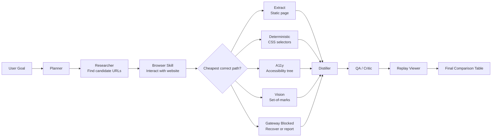

# Assignment: Browser Comparison Agent + Replay Viewer

## Build a browser-capable agent that completes a real comparison task on the web and produces a replay view of the run.

- The goal is to demonstrate work that Session 8’s web_search + fetch_url cannot reliably do: interacting with dynamic pages, filters, dropdowns, tabs, search forms, product cards, pricing pages, or multi-step workflows. web_search and fetch_url are useful for static pages, but they fail on JavaScript-rendered pages, click-revealed widgets, multi-page flows, and sites where useful data appears only after filtering or sorting.

- Students must choose this comparison task: Compare top 3 Hugging Face text-generation models sorted by likes.

- The agent must perform at least three visible browser actions, such as search, filter, sort, open product/detail pages, switch tabs, expand hidden content, or submit a form. Passive scraping from search snippets is not accepted.

The final output must include a structured comparison table and a replay viewer/report showing:

1. Original user goal
2. Planner DAG
3. Browser path chosen: extract / deterministic / a11y / vision / blocked
4. Browser actions taken
5. Screenshots or page-state logs
6. Extracted data
7. Final comparison table
8. Turn count and cost summary

The orchestrator must not be modified. Any new behavior must plug in through the skill catalogue or as a Browser skill extension.

